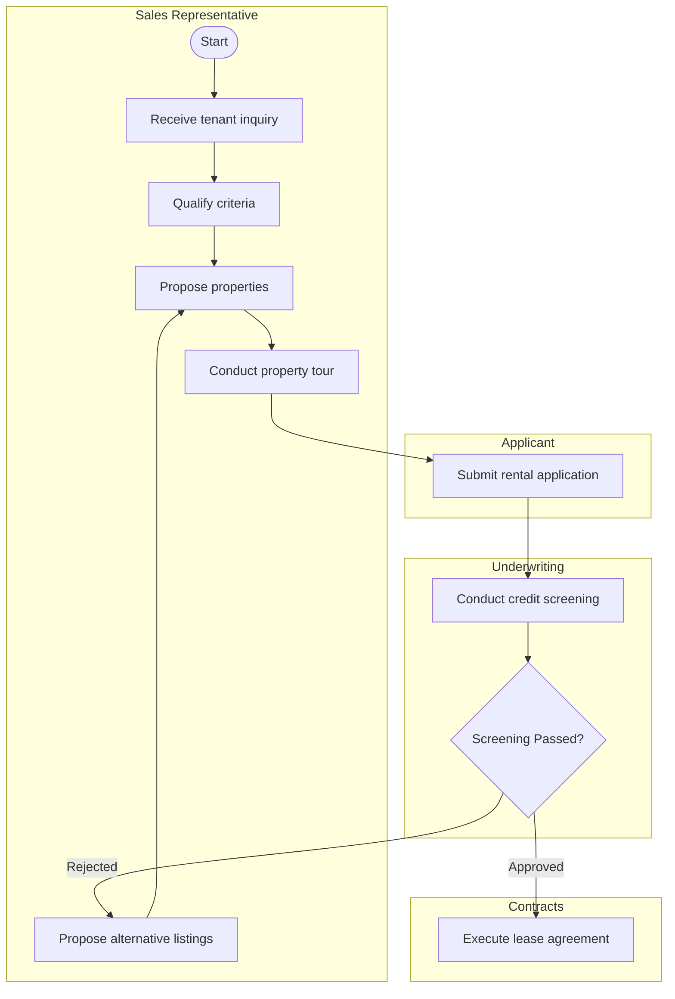

# Meeting Flow Live: Video/Audio to Markdown Flowchart Architecture & Plan

> **Source Demo**: [https://x.com/masa_okamura108/status/2101446065526632473](https://x.com/masa_okamura108/status/2101446065526632473)  
> **Original Author**: Okamura | Fractional CTO at WriteUp (@masa_okamura108)  
> **App Concept**: "Meeting Flow Live (Draw business workflows while listening to meetings)"  
> **Target Implementation**: Streamlit App (`app.py`) with clean modular Python utilities (`utils/`)  
> **Diagram Specification**: Markdown Flowchart (Mermaid flowchart `flowchart TD` rendered via `st.markdown`)  

---

## 1. Executive Summary & Reverse-Engineered Demo Analysis

### 1.1 Video Deconstruction ("Meeting Flow Live")
In the demo video:
1. **Core Concept**:
   - The user inputs or streams a meeting or hearing session (e.g., real estate tenant onboarding, ordering, approval workflows).
   - As the conversation progresses, an AI pipeline dynamically determines:
     - **Relevance Filtering**: Filters out small talk (e.g., "Did you try the new cafe across the street?" -> marked as chit-chat and bypassed).
     - **Action & Step Detection**: Detects business steps, department swimlanes/roles (Sales Representative, Applicant, Underwriting, Licensed Broker, Contracts, Finance, Property Management), and condition branches (`Conduct credit screening` -> `Screening Passed?` -> `Propose alternative listings`).
     - **Unresolved / Ambiguous Tasks**: Identifies unclear responsibilities or open questions (e.g., `Confirmation Item: Who is responsible for obtaining landlord approval before signing?`).
     - **Live Diagramming**: Automatically drafts and connects swimlane flowchart steps with decision nodes.

### 1.2 Objective for `app.py`
Refactor `app.py` into a **Meeting Flow Application** that:
- Accepts a meeting video (or audio/transcript input).
- Transcribes and parses meeting utterances into a structured timeline.
- Analyzes workflow operations, responsible departments, decision branches, and confirmation items.
- Generates and displays a **Markdown flowchart** (Mermaid.js flowchart markdown) directly in Streamlit with step-by-step logs, metrics, and confirmation alerts in clear American English.

---

## 2. Streamlit UI Architecture & Layout Design

Following the video layout and adhering strictly to project guidelines (no CSS layout hacks, no `st.divider` or `st.markdown("---")`, keep chat input at the bottom, encapsulate all code in functions, prevent LaTeX `$` escaping):

### Layout Structure:
```
st.set_page_config(page_title="Meeting Flow Live", layout="wide")

Top Bar / Header:
├── App Title: "Meeting Flow Live"
└── Status / Metric Indicators: [Total Steps] | [Identified Swimlanes] | [Action Items to Confirm]

Two-Column Main Interface:
├── Left Column (Meeting Input & Live Transcript Feed)
│   ├── Video/Audio Uploader (.mp4, .mov, .m4a, .mp3, .wav)
│   ├── Video Player Preview (st.video)
│   ├── Sample Demo Meeting Selector (e.g., Tenant Lease Onboarding)
│   ├── Run Analysis Button (st.button("Run Workflow Extraction (Mercury 2.5)", type="primary"))
│   ├── Confirmation Items Box (st.warning / Alert with unanswered role questions)
│   └── Utterance Log / Timeline (Utterance card with relevance badge, detected role, and action)
│
└── Right Column (Markdown Flowchart & Business Flow Output)
    ├── Tab 1: Flowchart Diagram (Markdown Flowchart via Mermaid st.markdown)
    │   └── Rendered Mermaid Diagram (with Swimlane / Subgraph support)
    ├── Tab 2: Step Table (Structured Step Table: Step ID, Swimlane, Type, Action Description)
    └── Tab 3: Markdown Source (Raw Markdown Flowchart Code & Copy/Download)
```

---

## 3. Workflow & Data Model

### 3.1 Utterance & Workflow Step Schema
```python
class Utterance(TypedDict):
    id: int
    timestamp: str          # e.g., "00:15"
    speaker: str            # e.g., "Sales Representative", "Applicant"
    text: str               # The transcript text
    is_business: bool       # Filtered out if chit-chat
    relevance_score: float  # 0.0 - 1.0
    action_type: str        # "add", "modify", "branch", "none"
    detected_step: str | None
    detected_role: str | None

class FlowNode(TypedDict):
    id: str                 # e.g., "N1", "N2"
    lane: str               # Swimlane / department, e.g., "Sales Representative"
    label: str              # Step description, e.g., "Receive tenant inquiry"
    node_type: str          # "start", "action", "decision", "end"

class FlowEdge(TypedDict):
    source: str             # Node ID
    target: str             # Node ID
    label: str | None       # Condition label, e.g., "Rejected", "Approved"

class ConfirmationItem(TypedDict):
    id: int
    question: str           # e.g., "Who is responsible for obtaining landlord approval before signing?"
    suggested_role: str | None
    confidence: float
```

### 3.2 Markdown Flowchart Generation (Mermaid)
Generate clean markdown flowchart code in American English, for example:

Streamlit renders this natively using:
```python
st.markdown(f"```mermaid\n{mermaid_flowchart_code}\n```")
```

---

## 4. Codebase Architecture

### 4.1 Dependency Updates (`requirements.txt`)
Ensure the following packages are present without version numbers:
- `streamlit`
- `requests`
- `openrouter`

### 4.2 Utility Modules (`utils/`)
- `utils/meeting_analyzer.py`:
  - Parses meeting transcripts and audio/video input.
  - LLM integration with OpenRouter (using Inception Mercury 2.5) to classify conversational turns (business vs chit-chat) and extract workflow steps.
  - Built-in American English sample dataset (Tenant Lease Onboarding: Sales Rep -> Applicant -> Underwriting -> Broker -> Contracts -> Finance -> Property Management) for instant zero-token testing.
- `utils/flowchart_generator.py`:
  - Pure function `build_mermaid_flowchart(nodes, edges, lanes) -> str`
  - Generates standard GitHub-compatible markdown Mermaid syntax.
  - Handles swimlanes (subgraphs), decision diamond nodes (`{...}`), terminal pills (`([Start])`), and labeled condition links (`-->|"label"|`).
  - Formats markdown safely with fullwidth '＄' to avoid LaTeX errors.
- `app.py`:
  - Complete Meeting Flow Live application interface.
  - Provides video upload, sample scenario loader, live utterance timeline, confirmation alerts, and the markdown flowchart viewer.
